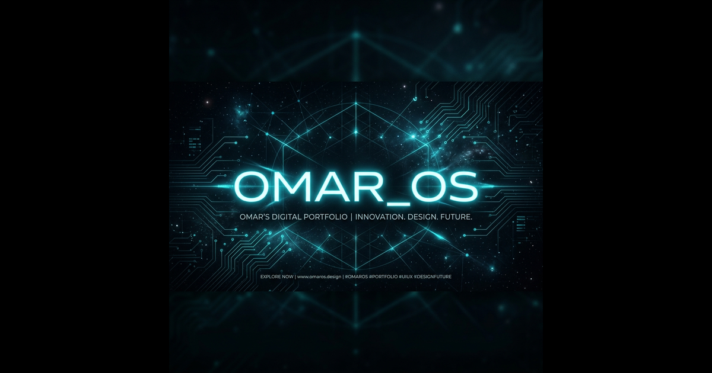

# Nexus Engine / Abouajaja_Omar OS



A high-performance, modular **Life Operating System** and digital portfolio built by [Omar Abouajaja](https://omarabouajaja.dev/). This platform bridges the gap between a public-facing creative showcase and a private, production-grade administrative command center for freelance operations and IoT telemetry.

Built on an industrial "cyber-aesthetic" design system, the architecture avoids standard templates, heavily utilizing hardware acceleration, glassmorphism, and a robust decoupled backend.

---

## ⚡ Core Ecosystem

### 1. The Public Node (Portfolio)
A hyper-optimized frontend designed to secure freelance contracts and showcase engineering capabilities.
- **Dynamic 3D Visualization**: Real-time interactive components via React Three Fiber.
- **Multilingual Support**: Fully localized (EN/FR/ES/AR) architecture using `i18next`.
- **Progressive Web App (PWA)**: Installable as a native, standalone mobile application on iOS and Android.

### 2. The Command Center (Admin OS)
A heavily fortified, private dashboard accessible only via hidden UI triggers and authenticated tokens.
- **Focus Mode & Telemetry**: Native Pomodoro workflows integrated with ESP32/IoT fleet monitoring.
- **Dynamic Resume Pipeline**: Compiles live PostgreSQL database records into an exportable PDF resume on the fly.
- **WebRTC Screen Casting**: Peer-to-peer screen mirroring capabilities built natively into the browser.
- **LocalDrop**: A peer-to-peer file transfer system running on WebRTC data channels.

---

## 🛠 Tech Stack

**Frontend Framework**
- React 18 (Vite)
- Tailwind CSS v3 (Custom HSL Color Tokens)
- Framer Motion (Hardware-accelerated animations)
- React Three Fiber / Drei (3D Rendering pipeline)

**Backend & Infrastructure**
- Supabase (PostgreSQL, Edge Functions, Realtime Subscriptions)
- React Query (Data Fetching & Caching)
- Vite PWA (Service Workers & Offline caching)

---

## 🚀 Deployment & Installation

### Local Development Setup

1. **Clone the repository:**
   ```bash
   git clone https://github.com/OmarABouajaja/My_portfolio.git
   cd My_portfolio
   ```

2. **Install core dependencies:**
   ```bash
   npm install
   ```

3. **Environment Configuration:**
   Copy the example environment file and insert your Supabase credentials:
   ```bash
   cp .env.example .env
   ```
   *Note: Ensure your `VITE_SUPABASE_URL` and `VITE_SUPABASE_PUBLISHABLE_KEY` are valid. If missing, the app elegantly degrades into "Mock Mode."*

4. **Initialize Dev Server:**
   ```bash
   npm run dev
   ```

---

## 🔐 Administrative Access

To maintain a clean public facade, the admin dashboard is hidden. 
**To Access the Command Center:**
1. Navigate to the top navigation bar.
2. **Double-click** the `ABOUAJAJA_OMAR/` logo or press `Cmd+K` to open the Command Palette.
3. Authenticate using your secure Supabase administrator credentials.

---

## 📄 License & Legal

Distributed under the MIT License. See `LICENSE` for more information.
Copyright © 2026 Omar Abouajaja. All rights reserved.
